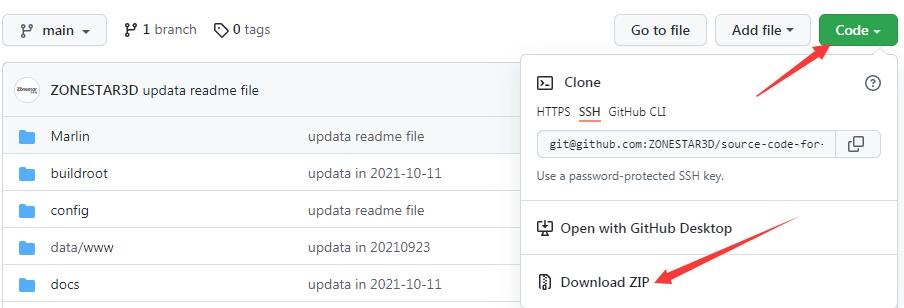

## ZONESTAR 3D Printer Firmware Source Code
###  [Configured machines list](./config/)
|     Config                                    |    Printer Model    |    Control board    |  
|:---------------------------------------------:|:-------------------:|:-------------------:|  
|  [D805S_ZM3E4](./config/D805S_ZM3E4)          |    D805S(M2/R2)     |       ZM3E4         |  
|  [D805S_ZRIB](./config/D805S_ZRIB)            |    D805S(M2/R2)     |       ZRIB          |
|  [P802N_ZM3E4](./config/P802N_ZM3E4)          |    P802N_ZM3E4      |       ZM3E4         |
|  [P802N_ZRIB](./config/P802N_ZRIB)            |    P802N(R2/M2)     |       ZRIB          |
|  [P802N_ZRIB_5KEY](./config/P802N_ZRIB)       |    P802N(R2/M2)     |       ZRIB          |
|  [P802QR2_ZM3E4](./config/P802QR2_ZM3E4)      |    P802QR2          |       ZM3E4         |
|  [P802QR2_ZRIB](./config/P802QR2_ZRIB)        |    P802QR2          |       ZRIB          |  
|  [Z5S_ZM3E2](./config/Z5S_ZM3E2)              |    Z5S(M2/R2)       |       ZM3E2         | 
|  [Z5X_ZM3E2](./config/Z5X_ZM3E2)              |    Z5X(M2/R2)       |       ZM3E2         |
|  [Z5X_ZMIB](./config/Z5X_ZMIB)                |    Z5X(M2/R2)       |       ZMIB          | 
|  [Z5XM3_ZM3E4](./config/Z5X_ZMIB)             |    Z5X(M3/R3)       |       ZM3E4         |
|  [Z6_ZM3E2](./config/Z6_ZM3E2)                |    Z6               |       ZM3E2         |  
|  [Z6_ZMIB](./config/Z6_ZMIB)                  |    Z6               |       ZMIB          |
|  [Z8PM2](./config/Z8PM2)                      |    Z8P(M2/R2)       |       ZM3E4         |  
|  [Z8PM3](./config/Z8PM3)                      |    Z8P(M3/R3)       |       ZM3E4         |  
|  [Z8PM4](./config/Z8PM4)                      |    Z8P(M4/E4)       |       ZM3E4V1       |  
|  [Z8PM4_MK2](./config/Z8PM4_MK2)              |    Z8PMK2(M4/E4)    |       ZM3E4V2       | 
|  [Z8PM4_MK2A](./config/Z8PM4_MK2A)            |    Z8PMK2(M4/E4)    |       ZM3E4V3       | 
|  [Z8R3_ZRIB](./config/Z8R3_ZRIB)              |    Z8X(R3)          |       ZRIB          |
|  [Z8T_ZM3E4](./config/Z8T_ZM3E4)              |    Z8T(M3)          |       ZM3E4         |
|  [Z8T_ZRIB](./config/Z8T_ZRIB)                |    Z8T(M3)          |       ZRIB          |
|  [Z8X_ZM3E4](./config/Z8X_ZM3E4)              |    Z8X(M2/R2)       |       ZM3E4         |    
|  [Z8X_ZRIB](./config/Z8X_ZRIB)                |    Z8X(M2/R2)       |       ZRIB          |    
|  [Z9M2_ZM3E4](./config/Z9M2_ZM3E4)            |    Z9M2(R2S)        |       ZM3E4         |  
|  [Z9M3_ZM3E4](./config/Z9M3_ZM3E4)            |    Z9M3(R3)         |       ZM3E4         |  
|  [Z9M3_ZRIB](./config/Z9M3_ZRIB)              |    Z9M3(R3)         |       ZRIB          |
|  [Z9M4_ZM3E4](./config/Z9M4_ZM3E4)            |    Z9M4             |       ZM3E4V1       |  
|  [Z9V5-MK1/MK2](./config/Z9V5)    	         |    Z9V5Pro-MK1(2)   |       ZM3E4V2       |  
|  [Z9V5_MK3](./config/Z9V5_MK3)                |    Z9V5Pro-MK3      |       ZM3E4V2       |
|  [Z9V5_MK4](./config/Z9V5_MK4)                |    Z9V5Pro-MK4      |       ZM3E4V2       |
|  [Z9V5_MK5](./config/Z9V5_MK5)                |    Z9V5Pro-MK5      |       ZM3E4V2       |
|  [Z9V5_MK6](./config/Z9V5_MK6)                |    Z9V5Pro-MK5      |       ZM3E4V3       |
|  [Z10M2_ZRIB](./config/Z10M2_ZRIB)            |    Z10M2            |       ZRIB          |  
|  [Z10M2_ZM3E4](./config/Z10M2_ZM3E4)          |    Z10M2            |       ZM3E4         |  
|  [Z10R2_ZM3E4](./config/Z10R2_ZM3E4)          |    Z10R2            |       ZM3E4         |  

-----
## How to build firmware
### Step 1. Prepare the compilation environment
1. Install "Visual Studio Code: Visit the [***Setting up Visual Studio Code***](https://code.visualstudio.com/docs/setup/setup-overview) page to download and install the latest Visual Studio Code for your particular platform.  
2. Install the PlatformIO IDE extension: Head over to the [***Get PlatformIO IDE***](https://platformio.org/install/ide?install=vscode) page to learn how to install PlatformIO IDE extension in Visual Studio Code.  
**More detail, please refer to** [***Install marlin compilation environment***](https://marlinfw.org/docs/basics/install_platformio_vscode.html)  

### Step 2. Prepare firmware source code
1. Download firmware source code to your PC and unzip it.  
    
2. Choose and replace config files  
   - Find the configuration files of your machine from the **"config"** directory.   
   - Copy and replace ***configuration.h*** and ***configuration_adv.h*** to "marlin" directory.   
   - Copy and replace ***platformio.ini*** to root directory of the source code.  
   - Modify "configuration.h" and "configuration_adv.h" according to the setting of your machine if need.   
3. Open the project in Visual Stuido Code  
Use the "Open Folder" in the Visual Studio Code "File" menu to open the source code directory which you stored, e.g. "main".  

### Step 3. Compile firmware
1. Run the "Run build task" command in the Visual Studio Code "Terminal" menu, and then choose "PlatformIO:build" task to build the firmware bin (or Hex) file.
   - **32bits control board(ZM3E2/ZM3E4)**: firmware.bin file.
   - **8bits control board(ZMIB/ZRIB)**: firmware.hex file.
2. Wait for the build finished.
3. Find the *firmware.bin (32-bits control board)* or *firmware.HEX (8-bits control board)* file in the ".pio/build/{board}" of the source code directory.    

<!-- ----
#### [Patchs](https://github.com/ZONESTAR3D/source-code-for-3d-printer/tree/main/patch)
While compilation, Visual Studio/PlatformIO will automatically download the libraries that the program depends on, but the downloaded libraries may not be compatible with the source code. You can do once compilation first, and then download the libraries from the link below and overwrite the downloaded libraries (*libraries directory*: {your soulcode directory}/.pio/libdeps/{compile environment name}).
- if you used a 128x64 dots LCD screen, please refer to [**U8glib**](https://github.com/ZONESTAR3D/source-code-for-3d-printer/tree/main/patch#2-u8glib).
- if you used a 1604 or 2004 LCD screen, please refer to [**LiquidCrystal.h**](https://github.com/ZONESTAR3D/source-code-for-3d-printer/tree/main/patch#3-liquidcrystalh). -->

----
## Upload firmware to your 3d printer control board
1. For 32 bits control board (ZM3E2/ZM3E4), you can upgrade the firmware from the SD card.
2. For 8 bits control board (ZRIB/ZMIB), you need to upgrade firmwre by PC (from USB cable), about detail, please refer to [**upload firmware**](https://github.com/ZONESTAR3D/Firmware/tree/master/Firmware_Upload_tool_for_ZRIB_ZMIB)

----
## License
Marlin is published under the [GPL license](/LICENSE) because we believe in open development. The GPL comes with both rights and obligations. Whether you use Marlin firmware as the driver for your open or closed-source product, you must keep Marlin open, and you must provide your compatible Marlin source code to end users upon request. The most straightforward way to comply with the Marlin license is to make a fork of Marlin on Github, perform your modifications, and direct users to your modified fork.

While we can't prevent the use of this code in products (3D printers, CNC, etc.) that are closed source or crippled by a patent, we would prefer that you choose another firmware or, better yet, make your own.
